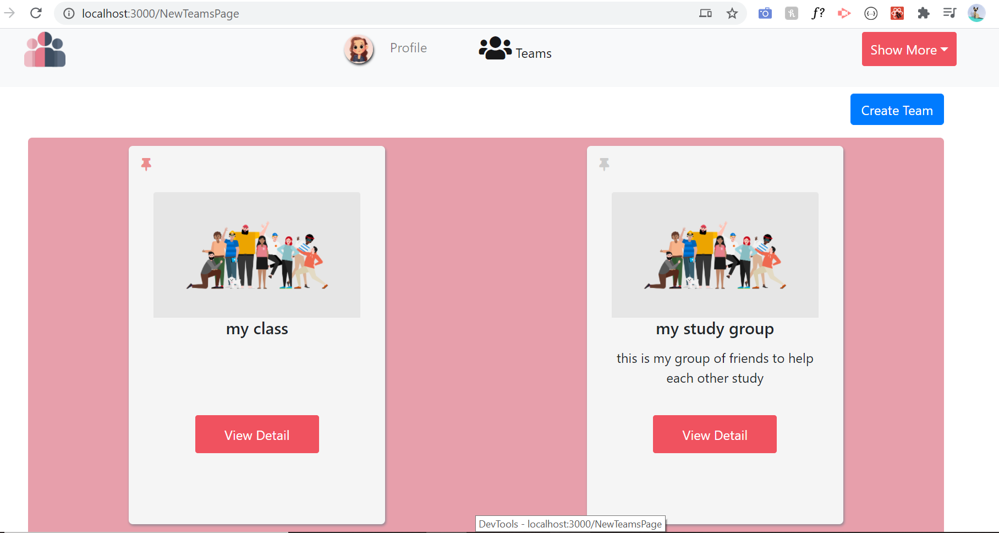

# Group Management App
Welcome to my Application. The app was designed and built to manage my group
The groups can be any type of groups of any size. For example a teacher creating a group consisting of his/her students either focused on a subject or a certain grade. Other type can be managing groups consisting of people having common interests or goals. 

The application was built on MERN stack. it allows users to create groups, add members. the groups have discussion boards where the members can create/start discussion on any topic they want.

## Features

<!-- * [Dashboard](#Dashboard) -->
* [Groups/Teams](#Groups/Teams)
* [Group Home Page](#GroupHomePage)
* [Discussions](#Discussions)
* [Events](#Events)
* [Settings](#Settings)
* [Houses / Departments](#Houses)
* [Roles](#Roles)
* [Themes](#Themes)
* [Grid To List](#GridToList)
<!-- ## Dashboard
Dashboard contains a summary of the group, such as the members, houses/department.  it also showcases the upcoming birthdays of the members in the current month.  -->

## Groups/Teams
User can create any number of groups. 

## Discussions
the groups have discussion boards where the members can create/start discussion on any topic they want. Users can also add polls to their discussion where other members can vote. 

## Events
Users are also able to create events. They can schedule the events timeline under the timeline section. 
    * [Events Timeline](#Events-Timeline)

## Settings
Settings allows to setup the groups roles and house

## Houses
In cases when the groups are of considerable size, there is option to create houses or departments.  Members can be assigned to these houses. One member can be only assigned to only one house

## Roles
You can add roles aspect where Members can be assigned these roles. 

